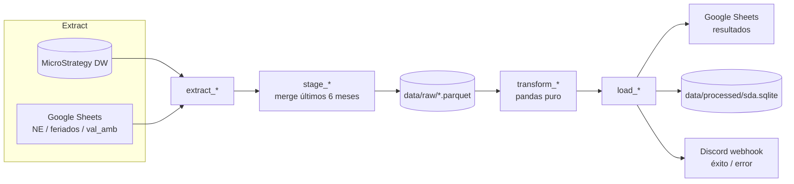
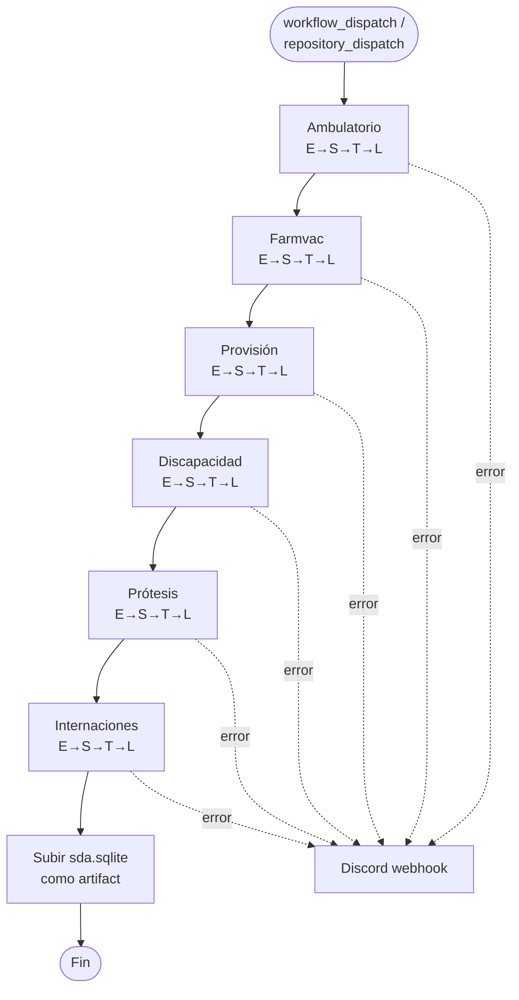

# SdA — Seguimiento de Autorizaciones

Pipeline diario de seguimiento de autorizaciones para una aseguradora de salud. Extrae datos crudos desde un Data Warehouse en **MicroStrategy**, calcula proyecciones diarias y de ejercicio frente a niveles esperados, y publica los resultados en **Google Sheets** y en una base **SQLite** local para consulta histórica.

Los pipelines se disparan manualmente desde atajos de iPhone, que llaman a workflows de **GitHub Actions** vía `workflow_dispatch` / `repository_dispatch`.

## Qué calcula

Para cada rubro (Ambulatorio, Farmacia y Vacunas, Discapacidad, Prótesis, Provisión, Internaciones) el pipeline compara lo autorizado realmente contra un **Nivel Esperado** cargado en Google Sheets, y proyecta cómo va a cerrar el mes en curso usando el historial reciente (promedios por día de la semana, ajustados por feriados/días no laborables/turísticos).

## Arquitectura: E → S → T → L

Cada pipeline sigue siempre el mismo patrón de 4 etapas, una carpeta por etapa:

| Etapa | Carpeta | Qué hace | I/O |
|---|---|---|---|
| **E**xtract | `src/extract/` | Trae datos crudos desde MicroStrategy (`mstrio-py`) o tablas auxiliares de Google Sheets | Red |
| **S**tage | `src/stage/` | Persiste/mergea lo extraído en parquet local, manteniendo los últimos 6 meses | `data/raw/*.parquet` |
| **T**ransform | `src/transform/` | Calcula las proyecciones en memoria (pandas puro, sin I/O) | — |
| **L**oad | `src/load/` | Escribe el resultado en Google Sheets y guarda un snapshot diario en SQLite | Red + `data/processed/sda.sqlite` |

`src/pipelines/<nombre>.py` orquesta las 4 etapas y notifica éxito/error a Discord.



### Importante: la extracción (E) sólo es necesaria en local o al inicio del job de CI

En GitHub Actions, el paso T→L se ejecuta llamando a `python src/pipelines/<nombre>.py`, que internamente corre sólo `_run_tl()` — **no toca MicroStrategy**. Las credenciales `MSTR_USER` / `MSTR_PASSWORD` sólo se necesitan en el paso E→S. Para uso local, la función `run()` de cada pipeline hace el ciclo completo E→S→T→L.

## Pipelines disponibles

| Pipeline | Reportes / fuentes | Tabs escritos en Google Sheets |
|---|---|---|
| `ambulatorio` | Report Ambulatorio (MSTR) + NE_amb, feriados, val_amb (Sheets) | `amb_seg_diario`, `amb_general` |
| `farmvac` | Reports Farmacia + Vacunas (MSTR) + NE_farm (Sheets) | `farmvac_seg_diario`, `farmvac_gral_Q`, `farmvac_gral_imp`, `farm_proy_imp_diario` |
| `discapacidad` | Report Discapacidad (MSTR) + tabla auxiliar de mapeo | `disca_gral` |
| `protesis` | Report Prótesis (MSTR) | `protesis_gral` |
| `provision` | Reports Provisión + Provisión diario (MSTR) + NE_provision (Sheets) | `prov_gral`, `prov_diario` |
| `internaciones` | Reports Sanatorial + Quirúrgicas (MSTR) | `sanatorial`, `quirurgicas`, `consolidado_sanatorial`, `consolidado_quirurgicas` |
| `check_dw` *(no es E→S→T→L)* | Tabla de control de procesos del DW + cubos de MicroStrategy (`fetch_cubos_info`) | — (notifica a Discord en **dos mensajes separados**: estado del DW y estado de cubos) |

Todas las salidas también se snapshotean diariamente en `data/processed/sda.sqlite` (una tabla por tab de Sheets, con columna `fecha_carga`).

`master` (`.github/workflows/master.yml`) corre los 6 pipelines en secuencia en un único job y sube `sda.sqlite` como artifact al final.



## Estructura del repositorio

```
src/
  extract/      # pull desde MicroStrategy o Google Sheets
  stage/        # merge en parquet local (data/raw/*.parquet), retiene 6 meses
  transform/    # cálculo de proyecciones, pandas puro, sin I/O
  load/         # escritura a Google Sheets + snapshot en SQLite
  pipelines/    # orquestación E→S→T→L + notificaciones Discord
  utils/        # conexiones (MSTR/Google), fechas, Discord, helpers de Sheets, mapeos
scripts/
  check_dw.py   # chequea última actualización de procesos del DW
data/
  raw/          # parquets de staging (uno por pipeline)
  processed/    # sda.sqlite — snapshots históricos
.github/workflows/  # un workflow por pipeline + master.yml
main.ipynb      # notebook para correr todos los pipelines en local
```

## Cómo correr en local

### 1. Setup

```bash
pip install -r requirements.txt
```

Variables de entorno (en `.env` o exportadas):

```
MSTR_USER=...
MSTR_PASSWORD=...
DISCORD_WEBHOOK_URL=...   # opcional en local
```

Credenciales de Google: archivo `credentials.json` (service account) en la raíz del repo.

### 2. Ejecutar un pipeline completo (E→S→T→L)

```bash
PYTHONPATH=. python -c "from src.pipelines.ambulatorio import run; run()"
```

O abrir `main.ipynb`, que tiene una celda por pipeline llamando a `run()`.

### 3. Ejecutar sólo una etapa

```bash
# Sólo re-extraer y stagear el historial reciente (E→S)
PYTHONPATH=. python -c "
from src.extract.ambulatorio import extract_u6m
from src.stage.ambulatorio import stage_u6m
stage_u6m(extract_u6m())"

# Sólo verificar el estado del DW
PYTHONPATH=. python scripts/check_dw.py
```

Para Ambulatorio también hay targets de `Makefile` (`make sync-complete`, `make sync-u6m`, `make run-ambulatorio`).

No hay tests automatizados — la verificación se hace corriendo el pipeline end-to-end e inspeccionando la salida en Google Sheets.

### Notas sobre el staging

- Los parquets de `data/raw/` deben existir antes de poder usar el modo incremental (`stage_u6m` / equivalentes). Si no existen, hay que correr primero la versión "complete" del extract+stage para bootstrapear el historial.
- El filtro de fecha es siempre `df['Fecha'] < hoy` — los datos de hoy se excluyen de los cálculos aunque ya estén en el parquet.

## Cómo correr en GitHub Actions

Cada pipeline tiene su propio workflow en `.github/workflows/`, disparable manualmente (`workflow_dispatch`) o vía `repository_dispatch` con un `type` específico (usado por los atajos de iPhone):

| Workflow | `repository_dispatch` type |
|---|---|
| `ambulatorio.yml` | `actualizar-ambulatorio` |
| `farmvac.yml` | `actualizar-farmvac` |
| `discapacidad.yml` | `actualizar-discapacidad` |
| `protesis.yml` | `actualizar-protesis` |
| `provision.yml` | `actualizar-provision` |
| `internaciones.yml` | `actualizar-internaciones` |
| `master.yml` | `actualizar-todo` |
| `check_dw.yml` | `check-dw` |

Cada job:
1. Instala dependencias y restaura un cache del parquet (best-effort).
2. Escribe `credentials.json` desde el secret `GOOGLE_CREDENTIALS`.
3. Corre el extract+stage (E→S) usando `MSTR_USER` / `MSTR_PASSWORD`.
4. Corre `python src/pipelines/<nombre>.py` (T→L), que escribe a Sheets/SQLite y notifica éxito por Discord.
5. Si falla cualquier paso, notifica el error a Discord con un link al run.

### Secrets requeridos

| Secret | Uso |
|---|---|
| `MSTR_USER` / `MSTR_PASSWORD` | Login a MicroStrategy (sólo en el paso E→S) |
| `GOOGLE_CREDENTIALS` | JSON completo de la service account de Google |
| `DISCORD_WEBHOOK_URL` | Notificaciones de éxito/error |

### Google Sheets de salida

| Sheet ID | Pipeline |
|---|---|
| `1x0vover_16Q-XQZfJgeGBkfpi_R44PVO7y2x7U8Kz1Y` | ambulatorio |
| `1DNpmKUjIOuHPCBrMN8Ww5xlmJ1XQAvGcH3wMFujvMNU` | farmvac |

(IDs de Sheets de entrada/auxiliares en cada módulo de `src/extract/`.)

> **Nota**: el cache de parquet en CI está keyado por fecha UTC (`YYYYMMDD`), no por `github.run_id`. Esto significa que si un mismo pipeline se vuelve a disparar el mismo día, reusa el parquet cacheado y se saltea la extracción desde MicroStrategy; un día nuevo siempre fuerza una extracción fresca.

## Resiliencia ante errores transitorios

- Los fetches a MicroStrategy (`_fetch` en cada `src/extract/*.py`) reintentan hasta 3 veces ante `ConnectionError`, vía `tenacity`.
- Las lecturas/escrituras a Google Sheets (`leer_tabla_df` / `escribir_tabla_df` en `src/utils/gc_functions.py`) reintentan hasta 3 veces ante errores transitorios (caídas de conexión, timeouts, HTTP 429/5xx).
- Las tablas auxiliares de `src/utils/mapping.py` se cargan de forma perezosa (en el primer uso), no al importar el módulo — así un error transitorio de Sheets no rompe el `import` de módulos que dependen de él.
